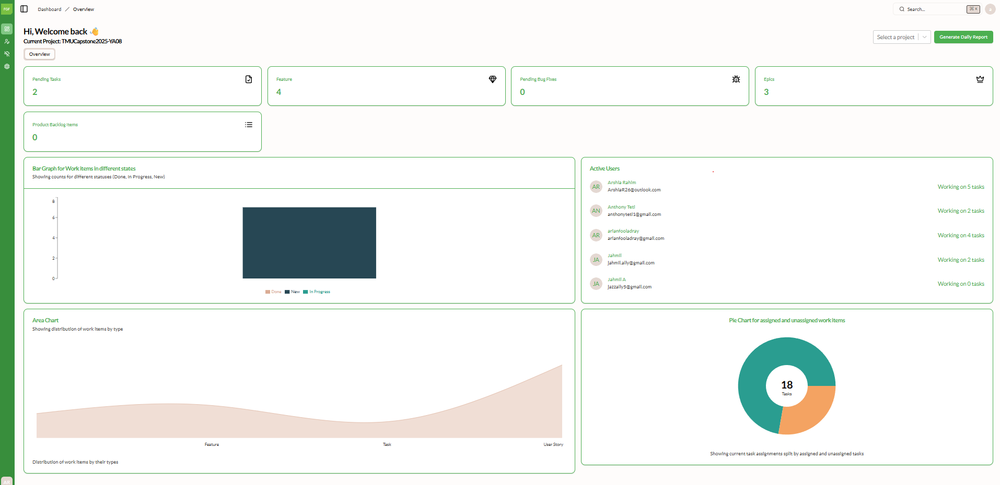
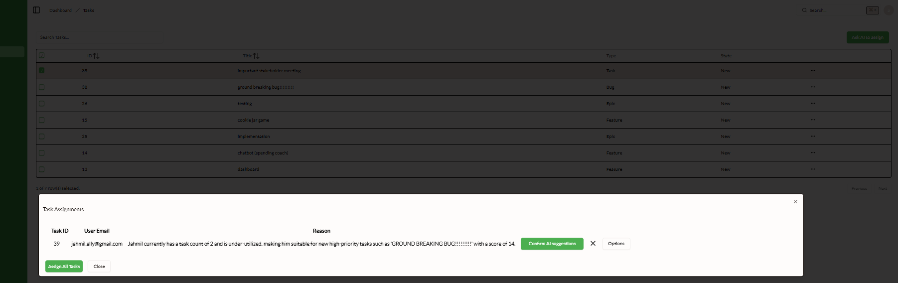
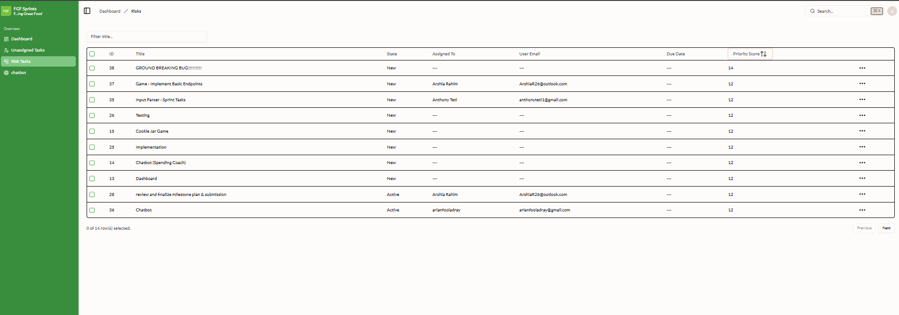
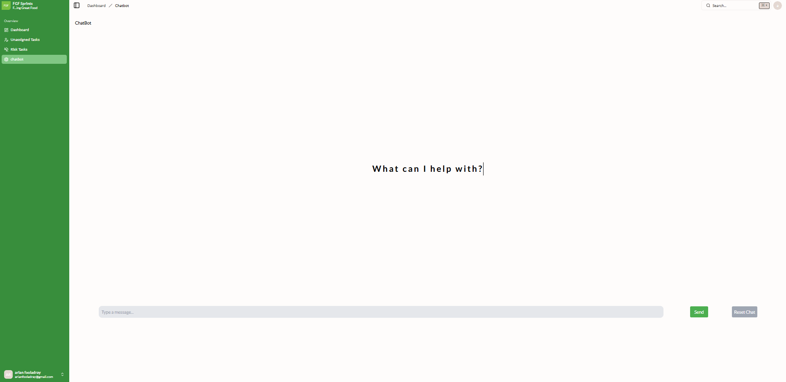

# FGF IT Case Competition — Azure DevOps Command Center

## Abstract

This project delivers an **integrated project-management assistant** for teams using **Azure DevOps**. A **Next.js** dashboard with **Microsoft Entra ID** authentication connects to a **Flask** backend that queries DevOps over REST using a **personal access token**, and augments planning with **OpenAI** models for structured outputs (risk ranking, task-assignment recommendations) and a **tool-calling chatbot**. The system surfaces **portfolio metrics**, **per-user workload**, **AI-assisted assignment of unassigned work**, **risk-oriented work-item views**, **status reporting**, and optional **Microsoft Graph** flows for email. It was built for a **case competition**, starting from an open **Shadcn / Next.js** admin template that was extended, secured with **environment-based configuration**, and wired to production-style APIs rather than placeholder data on the main user journeys.

## What this project is

This is a **case-competition** build: a web dashboard that plugs into **Azure DevOps** so a team can see work in one place, switch projects, pull stats, use **AI** for task assignment and risk triage, generate status reporting, and chat with a **bot** that calls the same backend APIs.

**Provenance:** The UI started from an open **Next.js + Shadcn** admin dashboard starter ([Kiranism / next-shadcn-dashboard-starter](https://github.com/Kiranism/next-shadcn-dashboard-starter)–style stack). This fork **rewired** it for the competition: **Microsoft Entra ID (Azure AD)** sign-in, a **Flask** API in `Back End/`, `.env`-based secrets, NextAuth ↔ Flask token handoff, and real Azure DevOps + OpenAI integrations instead of demo data on the main flows.

You sign in with your Microsoft work/school account; the app talks to DevOps using a **PAT** on the server and optionally forwards tokens for **Microsoft Graph** (e.g. Outlook drafts).

## Screenshots

Assets live in the [`photos/`](photos/) folder (paths below are relative to this README).

**Dashboard overview** — project context, KPIs, charts, and team workload.



**Unassigned tasks — AI task assignment** — select work items on `/dashboard/tasks`, run AI suggestions, then confirm or assign in bulk. The modal shows recommended assignees with rationale tied to workload and priority.



**Risk tasks** — AI-assisted risk list and triage workflow.



**Chatbot** — natural-language access to DevOps data and tools.



---

## How each part of the app works

| Area | Route | What you get |
|------|--------|----------------|
| **Entry** | `/` | If you are not signed in, you are sent to Microsoft login; if you are, you land on the dashboard. |
| **Dashboard (Overview)** | `/dashboard` → `/dashboard/overview` | **Current Azure DevOps project** (dropdown loads org projects; switching calls the API and refreshes). **KPI-style cards** for open work by type (tasks, features, bugs, etc.) from DevOps. **Charts** (assignment, state, type) fed by Flask stats routes. **Team workload** from per-user task counts. **Generate Daily Report** / download ties into the backend status-report and Excel export. |
| **Unassigned Tasks** | `/dashboard/tasks` | Table of **unassigned** work items from DevOps. **AI-assisted assignment** (GPT suggests who should take what). You can assign to a user, including **bulk** updates, via Flask + DevOps REST. |
| **Risk Tasks** | `/dashboard/risks` | **Risk-oriented** items filtered through the backend (`/api/risk/...`). Row actions can drive **AI-generated email** text and **Outlook draft** creation when Graph token flow is set up. |
| **Chatbot** | `/dashboard/chatbot` | Simple chat UI; messages go to **`/api/chatbot/send_message`**, which uses OpenAI **tool/function** calling and the same DevOps helpers so the bot can reason about your project. Reset clears server-side chat state. |

**Still in the repo but not on the main sidebar** (template leftovers): **Kanban** (`/dashboard/kanban`), **Products** (`/dashboard/product`), **Employees** (`/dashboard/employee`), **Profile** (`/dashboard/profile`). Those are mostly starter/demo scaffolding unless you hook them up the same way as Overview / Tasks / Risks.

**Auth note:** After login, NextAuth posts the session to Flask **`/api/receive-token`** so the backend can store a **JWT** for Graph/Outlook. Keep Flask running on **port 5000** when using the dashboard.

---

## Technical reference

### Repository layout

| Path | Role |
|------|------|
| `next-shadcn-dashboard-starter/` | Next.js 14 (App Router), Shadcn UI, NextAuth (Azure AD provider) |
| `Back End/` | Flask app (`index.py`), Azure DevOps REST, OpenAI, chatbot, optional Graph/Outlook |
| `env.example` | Single-file reference for **both** backend `.env` and frontend `.env.local` |
| `run-all.ps1` | Opens two windows: Flask + `npm run dev` |

### Prerequisites

- **Node.js** 18+
- **Python** 3.10+ and `pip`
- Azure DevOps **org**, **project**, and **PAT** with scopes for work items, projects, and related APIs you use
- Microsoft Entra ID **app registration** (client ID, tenant ID, client secret) for NextAuth
- **OpenAI API key** for GPT routes (assignment, risk, chatbot, email generation)

### Backend (Flask)

```powershell
cd "Back End"
python -m venv .venv
.\.venv\Scripts\Activate.ps1
pip install -r requirements.txt
pip install flask-cors pandas
```

**Configuration**

- Copy **`Back End/.env.example`** → **`Back End/.env`** (see also root **`env.example`**).
- Required: `AZURE_DEVOPS_ORG`, `AZURE_DEVOPS_PROJECT`, `AZURE_DEVOPS_PAT`, `OPENAI_API_KEY`.
- Optional: `AZURE_DEVOPS_JWT_TOKEN` (often populated by `POST /api/receive-token` from NextAuth).
- **`app/config.py`** loads `.env` via `python-dotenv`. **`Back End/.gitignore`** includes `.env`.

```powershell
cd "Back End"
python index.py
```

Default API: **http://127.0.0.1:5000** (debug).

### System prompts (OpenAI)

All GPT usage lives in the **Flask** backend. There is **no** separate system prompt in the Next.js app for model calls—the UI only forwards user actions to REST routes.

**Shared chat helper (`helper/chatgpt.py` → `send_chat`)**  
Every call builds a small message stack:

1. **Base system:** `"You are a helpful assistant."`  
2. **Optional second system:** if the caller passes a non-empty `context` string, it is inserted as another `system` message (domain hints such as task logic).  
3. **User:** the main `prompt` (often includes JSON from Azure DevOps, instructions, and schema rules).

Structured outputs (JSON Schema) used for **risk ranking** and **automated task assignment** go through this path: the **user** message carries the heavy prompt; **`context`** is set to **`"Task assignment logic"`** for those flows (`app/risk.py`, `app/automated_task_assignment.py`).

**Chatbot (`chatbot/chat_handler.py` + `chat_data_struc.py`)**  
On startup, `ChatHandler` seeds the conversation with a **dedicated system prompt**: the model is described as a **PM assistant** with access to **Azure DevOps and Outlook**, and is told it may use **tools** (email, meetings, work items, risk list, users, priority scores, assign work item). That system line is stored as the first message in `ChatData` and is sent on every chat completion that uses **`send_chat_with_functions`**. Tool definitions (names, descriptions, JSON parameters) are attached separately as OpenAI **`tools`**—they are not part of the free-text system string but shape behavior the same way.

**Email helpers (`generate_gpt_email`, `generate_subject_line`)**  
These call `send_chat` with **`context=None`**, so only the default **“helpful assistant”** system applies; control is in the **user** prompt (e.g. “body only”, “no subject inside body”).

**Tuning**  
To change tone, safety, or tool usage: edit the **system** string in `ChatHandler.__init__` for the bot, the base string or `context` usage in `send_chat` for shared behavior, or the **user** prompts in `risk.py` / `automated_task_assignment.py` for scoring and ranking. After edits, restart Flask; no frontend env vars control prompts today.

### Frontend (Next.js)

```powershell
cd next-shadcn-dashboard-starter
npm install
```

Copy **`.env.example`** → **`.env.local`**. Set `AZURE_AD_*`, `NEXTAUTH_SECRET`, `NEXTAUTH_URL`. Redirect URI in Azure (Web): **`http://localhost:3000/api/auth/callback/azure-ad`**.

```powershell
npm run dev
```

Browser code calls Flask through **`/flask/...`** on the Next.js origin; **`next.config.js`** rewrites that to **`FLASK_BACKEND_URL`** (default `http://127.0.0.1:5000`). That avoids **CORS** / **Failed to fetch** when the app is opened as `http://localhost:3000`. Override in **`.env.local`** if Flask listens on another host/port.

### Run both (Windows)

From repo root:

```powershell
.\run-all.ps1
```

If execution policy blocks scripts: `Set-ExecutionPolicy -Scope CurrentUser -ExecutionPolicy RemoteSigned`.

### Troubleshooting

| Issue | What to check |
|--------|----------------|
| Azure AD / NextAuth errors | `.env.local` complete; `NEXTAUTH_URL` matches browser URL; redirect URI in app registration. |
| `ModuleNotFoundError: openai` | `pip install openai` in the Python env running Flask. |
| NumPy / pandas / pyarrow errors | Try `pip install "numpy<2"` or a clean venv for the backend. |
| Empty API data / CORS | Flask running on `127.0.0.1:5000`; PAT and org/project in `Back End/.env`. |

### Security

Do not commit **PATs**, **client secrets**, **JWTs**, or **OpenAI keys**. Use `.env` / `.env.local` only; rotate anything that ever appeared in git or chat.

### Next steps

Hardening beyond the competition baseline:

- **Authenticate every Flask route.** Today the API does not verify callers; anything that can reach the backend can use the shared org PAT and OpenAI key. Require a verified identity or service token on each route (e.g. validate Entra tokens on Flask, or a short-lived backend JWT / HMAC shared only with the Next.js server).
- **Lock down `POST /api/receive-token`.** Prove the caller is your app after a real login (shared secret, signed payload, or token validation)—do not accept arbitrary JSON as authoritative.
- **Move off a single org-wide PAT for all users.** Prefer per-user Azure DevOps OAuth, or a narrowly scoped service principal / managed identity with explicit checks that the signed-in user may act on a given project or work item.
- **Stop logging secrets.** Never print access tokens or PATs to stdout or logs; treat log aggregation as untrusted storage.
- **Avoid mutating `Back End/.env` at runtime in production** (project switching writes the file today). Prefer a database or managed config; keep secrets out of files that are easy to mis-copy or commit.
- **Tighten error responses** so clients get generic messages while detailed errors stay in server-side logs only (avoid leaking paths or internals via `500` bodies).
- **Rate-limit** expensive endpoints (GPT, bulk assign, chatbot) to limit abuse and cost.
- **Deploy behind HTTPS** with an explicit CORS allowlist for real origins; do not expose Flask directly to the internet without authentication.
- **Treat OpenAI traffic as sensitive** (work items, names). Consider **Azure OpenAI** in your tenant, private networking, and policies for retention and PII.
- **Harden the chatbot** against prompt injection (validate tool arguments, constrain tools, review untrusted work item text).
- **Run Flask without debug in production**, patch dependencies, and use scoped PATs / separate keys per environment with rotation.

### Attribution

Dashboard UI stack and patterns derive from the **Shadcn / Next.js dashboard starter** ecosystem; backend and competition-specific integrations are project-specific. See **`next-shadcn-dashboard-starter/README.md`** for the upstream template feature list (tables, forms, kbar, etc.).
